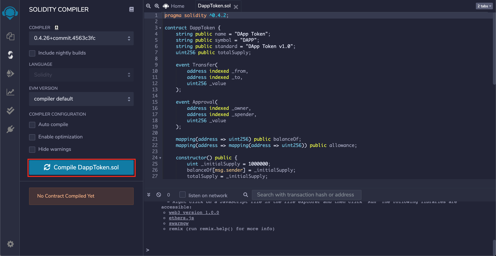
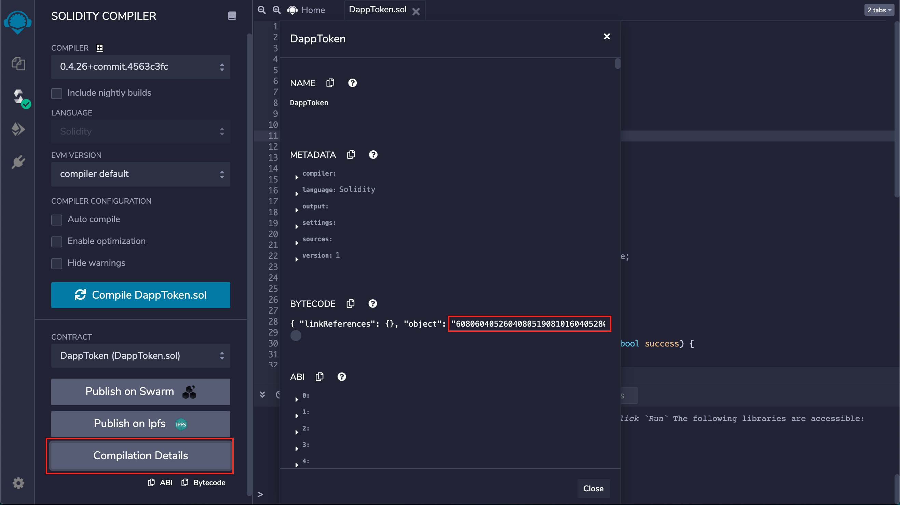

# Deploy a Contract  
## 5_deployContract.js
```
var Web3 = require('web3')
var url = '<INFURA/GANACHE_ENDPOINT>' // update this
var web3 = new Web3(url)

var Tx = require('@ethereumjs/tx').Transaction
var Common = require('@ethereumjs/common').default

const account1 = process.env.ADDRESS_1
const privateKey1 = Buffer.from(process.env.PRIVATE_KEY_1, 'hex')

web3.eth.getTransactionCount(account1, (err, txCount) => {
	// Smart contract data
	const data = '<CONTRACT_BYTE_CODE_HEX>' // Compile contract in Remix/Truffle

	// Build the transaction
	const txParams = {
		nonce: web3.utils.toHex(txCount),
		gasLimit: web3.utils.toHex(1000000), // Raise this
		gasPrice: web3.utils.toHex(web3.utils.toWei('50', 'gwei')),
		data: data
	}

	// Sign the transaction
	const common = new Common({ chain: 'ropsten' })
	const tx = Tx.fromTxData(txParams, { common })
	const signedTx = tx.sign(privateKey1)
	const serializedTx = signedTx.serialize()
	const rawTx = '0x' + serializedTx.toString('hex')

	// Broadcast the transaction
	web3.eth.sendSignedTransaction(rawTx, (err, txHash) => {
		console.log('err:', err, 'txHash:', txHash)
		// Use this txHash to find the contract on Etherscan
	})
})
```

The above program deploys a new solidity contract to an Ethereum network - in our case, Ropsten. When deploying a contract, no `to` field is needed in the transaction parameters object. Without this field, the entire network will receive the request and know that it is a contract creation transaction.  

The `data` field is used to hold the hexidecimal bytecode of the compiled contract that is being deployed. We can use an IDE like Remix to compile contracts in a local environment and get the hexidecimal bytecode value for the `data` value.  

We use a simple token contract, `DappToken.sol`, as an example to deploy to the Ropsten network.  

Once deployed, we can read from the contract with the abi and contract address created.   

### Remix
Remix is a powerful, open source tool that helps you write Solidity contracts straight from the browser. Written in JavaScript, Remix supports both usage in the browser and locally.

Remix also supports testing, debugging and deploying of smart contracts and much more.

In Remix, a plug-in is provided to compile solidity contracts. Below, we can compile our contract `DappToken.sol`.



Remix gives us the ability to easily view a variety of contract compilation details. Included in these details is the hexidecimal bytecode needed in the `data` field of our transaction object. We can also get the contract abi if needed to read and make transactions to the contract once deployed.   



**Documentation:**  
* [Read the Docs](https://remix-ide.readthedocs.io/en/latest/#)